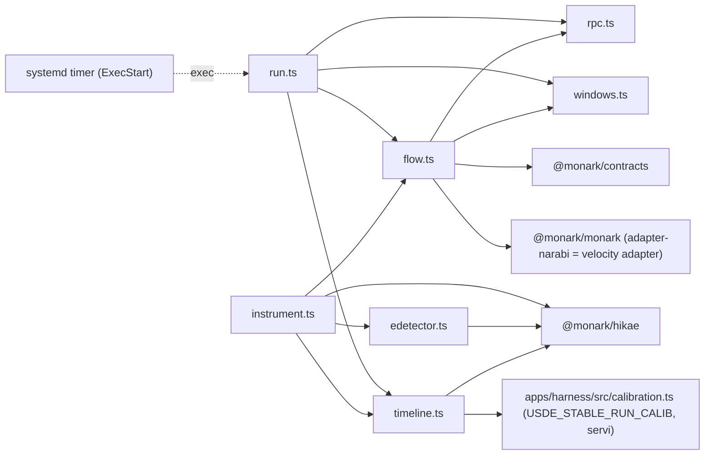
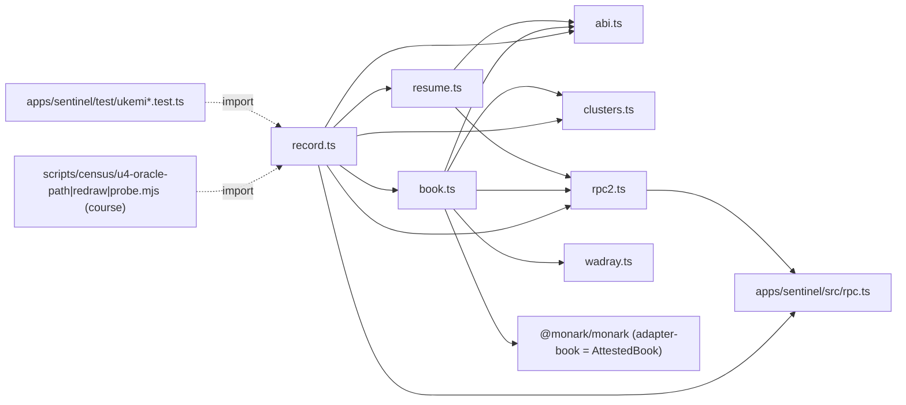
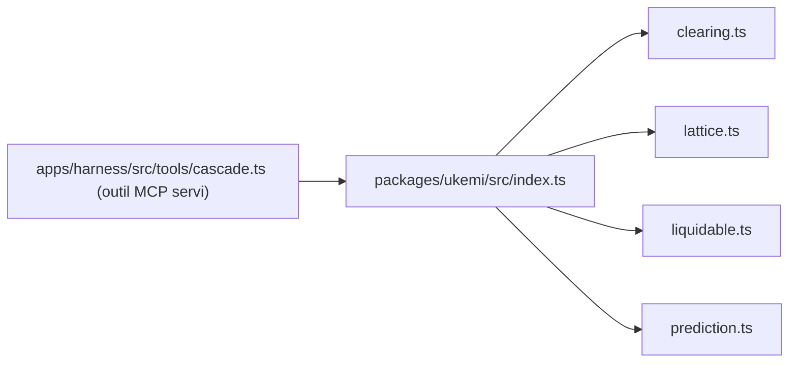
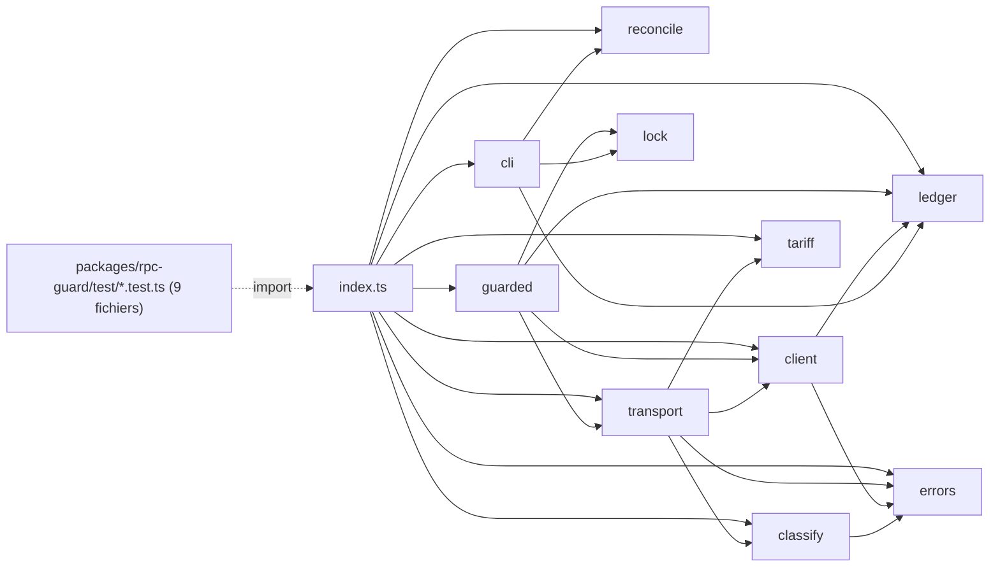

claude-opus-4-8[1m]

# CARTOGRAPHIE DE BRANCHEMENT — MONARK temps 1 (Narabi + Ukemi) — BASELINE mesuree

> Worker Opus 4.8 a contexte frais. Sortie = donnee brute pour l'orchestrateur (R-21 : verifiee adversarialement avant
> consommation). Lecture seule ; ecriture uniquement sous `F:\tmp\carto-t1\` ; aucun commit (R-20) ; aucun reseau ; rien sur `C:`.
> Baseline PRISE MAINTENANT (avant fusion de 2b-ii / 2b-iii / course U-4b-1b) pour que la cloture du temps 1 ne soit qu'un DIFF.
> Regle appliquee : Branchement (CLAUDE.md 2026-09-19 ; ADR-M018 D1-D5). Chaque chiffre -> `MESURES.md` (M-n). Aucun chiffre de 2nd main.

## 0. Provenance et methode

| Element | Valeur |
|---|---|
| Modele resolu (R-1) | **`claude-opus-4-8[1m]`** (prefixe `claude-opus-4-8` conforme ; effort max ; Opus 5 banni) |
| Depot | `F:\Monark`, branche `lot/etude-suite` |
| HEAD mesure | **`4d2efad`** (`4d2efad6c219466b22f41d91a407fd14dc097c40`), arbre propre (`git status --porcelain` vide) — M-0 |
| HEAD au demarrage (mission) | `b38a399` ; **`4d2efad` en descend** (`merge-base --is-ancestor` = 0) ; les 4 commits intermediaires sont **docs-only** (0 fichier de code du perimetre modifie, M-0) => le graphe est identique a b38a399 ; **2b-ii/2b-iii NON fusionnes** (baseline bien "avant") |
| Horloge | `date -u` = **2026-09-21T20:33:06Z** ; Node **v24.15.0** |
| Outil | `carto.mjs` (Node, sans dependance) — regenere `edges.tsv`/`nodes.tsv`/`unresolved.tsv` ; sha256 des 4 artefacts en M-2 |
| Perimetre temps 1 (decision 117) | **Narabi** = `apps/sentinel/src/**` (hors `ukemi/`), `scripts/*narabi*`, `deploy/**`, `probe-narabi.mjs` ; **Ukemi** = `apps/sentinel/src/ukemi/**`, `scripts/census/u3*`, `u4*`, `u4b/**`, `record-u4b-calib.mjs`, `packages/{hikae,contracts,rpc-guard,ukemi,monark(adaptateur narabi/book)}` ; **Bell** (`apps/bell/**`) cartographie mais **temps 2 = reste `upcoming`** partout |

**Bareme (ADR-M018 D1 ; Bell passe2 §2 durci).**
- **cable** = (a) le code passe l'oracle, (b) sa sortie est consommee par au moins un chemin **SERVI** (outil MCP expose, fichier publie lu par une surface, ou piece aval reelle servie), (c) un **test d'integration non-LLM** rejoue la composition de bout en bout, (d) l'ADR declare le tuyau.
- **fixture / upcoming** = consomme uniquement par un test unitaire, une fixture, une **demo** ou un **script de course/CLI** (pas de chemin servi). Legitime SI declare.
- **absent** = tuyau annonce sans code.

**Verdict d'ensemble.** Pour le temps 1, le registre public est **EXACT dans les deux sens** : chaque piece `built`/`upcoming`
revendiquee correspond a la mesure. Les 4 built (Shogen, Hikae, **Ukemi-moteur**, **Narabi**) ont un chemin servi + un test
d'integration ; le **recorder Ukemi** (`record.ts`->AttestedBook), le paquet **`@monark/rpc-guard`** et le **score-code gele U-4b**
sont mesures `upcoming` (consommateurs = tests / scripts de course), **conformement** au README (AttestedBook "upcoming until served,
wired at U-6"), a ADR-GARDE-HELIUS ("upcoming en 1a/2") et a ADR-U4b ("-1a upcoming"). **Bell est un puits pur** (0 arete entrante,
M-15) et **absent de tout registre public** => `upcoming` exact. La bascule attendue du paquet (`branche` au G7 2b-ii, `built` a la
1re course rapprochee — R-C) et du recorder n'a **pas** eu lieu a la baseline (2b-ii non fusionne, M-6). **Ecarts** : 2 items formes
neufs (CARTO-T1-1/-2, chemins payants hors garde non couverts par un grep annonce) + rappels d'items deja formes (NARABI-OPS-1d,
2b-iii, U-6, K-1, P1 E1-E10, Bell CARTO-B-1..9). **Aucun "du" nu.**

---

## 1. Graphe d'imports mesure (M-1 : 319 fichiers, 846 aretes internes distinctes)

Genres : import 655, import-type 126, export-from 38, export-type 26, dynamic-import 1 (M-1). 2 non resolues = assets non-code
(`.css`, `.json`, M-3). 34 specificateurs externes = dependances hors depot (M-3). Diagrammes = aretes **src->src** par produit
(les tests vivent dans `edges.tsv`/`nodes.tsv`, jamais dans le diagramme — reduction declaree). Sources : M-16.

### 1.1 Narabi (`apps/sentinel/src/**` hors ukemi/) — 10 noeuds

`run.ts` : `in_from_src=0` (M-16) — point d'entree invoque par `systemd` (arete d'EXECUTION `ExecStart=node .../apps/sentinel/src/run.ts`,
M-12), jamais importe. `timeline.ts -> apps/harness/src/calibration.ts` = la constante de calibration servie (jambe gate stable-run).

### 1.2 Ukemi RECORDER (`apps/sentinel/src/ukemi/**`) — 15 noeuds (dont tests)

Consommateurs de `record.ts` = **4 tests + 3 scripts de course** (M-6). **Aucune arete `record.ts -> @monark/rpc-guard`** (2b-ii non
fusionne). `record.ts`/`rpc2.ts` reutilisent `apps/sentinel/src/rpc.ts` (le module RPC de Narabi, partage intra-app).

### 1.3 Ukemi MOTEUR (`packages/ukemi`) — servi par l'outil MCP `cascade`

Seul consommateur `src` de `packages/ukemi` = `cascade.ts` (M-5) => chemin servi (`cascade -> gate`).

### 1.4 `@monark/rpc-guard` (le client budgete) — consomme UNIQUEMENT par ses tests

`in_from_src=0`, `in_from_test=9` (M-4). Le paquet est propre et complet mais **rien ne le route en production** a la baseline.

### 1.5 Backbone partage et Bell
- **Hikae** (`packages/hikae`) : consomme par `apps/harness` (gate) + `apps/sentinel/{timeline,edetector,instrument}` (tracker M009) => cable (servi). Base commune Narabi+Ukemi.
- **Contracts** (`packages/contracts`) : 6 contrats geles, consommes largement (hikae/monark/ukemi/harness/sentinel). Le 6e (**AttestedBook**) est "upcoming until served" (README:117).
- **Bell** (`apps/bell`, 39 noeuds) : **0 arete entrante** (M-15) ; Bell -> sentinel existe (`ethereum.ts -> ukemi/rpc2.ts` = site ripple R-D ; `*/collect,operators,quorum,rebase-* -> sentinel/rpc.ts`), jamais l'inverse. Bell = puits => `upcoming`.
- **atelier** (`packages/atelier`) : orphelin (0 consommateur, demo locale) — inchange depuis P1 (§5 P1).

---

## 2. Registre REVENDIQUE vs MESURE (cable / fixture / absent) — par piece du temps 1

Etat revendique : `fleet.ts` (M-13), README, skill, ADR "Tuyaux", TABLEAU. Etat mesure : chemin servi + test non-LLM (M-4..M-13).

### 2.1 Narabi (registre : **built**, 2 jambes servies)
| Piece | Revendique | Chemin servi mesure | Test non-LLM | Verdict |
|---|---|---|---|---|
| Contrat `AttestedFlow` (`packages/contracts`) | frozen, produit par Narabi | consomme par `flow.ts` + gate | `contracts_frozen`, `adapter-narabi.test.ts` | **cable** |
| Velocity adapter `fromAttestedFlow->Prediction` (`packages/monark/adapter-narabi.ts`) | ships & served (README:113/181) | `flow.ts -> @monark/monark` ; gate (harness `calibration.ts`/`attest.ts`) | `gate_stable_run_usde_committed_region_A7b` | **cable** |
| Sentinelle publiee `/narabi/` (run.ts->`timeline.jsonl`/`state.json`->Caddy->site) | daily published (fleet.ts:189 ; ADR-NARABI-OPS-1 tuyau 2) | `systemd`->`run.ts` (ExecStart, M-12) ; Caddy `handle_path /narabi/*` ; site `loadNarabi` fetch `/narabi/state.json`+`/narabi/timeline.jsonl` | `narabi_live_parses_real_state_shape` (rejoue les octets du **snapshot committe**, byte-exact) | **cable (publie)** — nuance : preuve committee = snapshot (`narabi-snapshot.ts`), live non re-verifie ici (lecture seule) ; "premier run reel 22/09 00:41Z" pending (TABLEAU:39) => cf. P1 E10 |
| `fromAttestedFlow -> gate` classe `stable-run-velocity-24h` (calibration USDe committee) | served region, one population (README:63) | outil MCP `gate` (M-10) + constante `USDE_STABLE_RUN_CALIB` (`harness/calibration.ts`, consommee par `timeline.ts`, M-16) | `gate_stable_run_usde_committed_region_A7b` (runGate direct) | **cable** — nuance P1 E2/§2 : prouve au niveau fonction, pas sur le fil `registry.run()` |
| Durcissement OPS (probe/alerte/state-cross-check, `apps/sentinel/src/{rpc,run,timeline}.ts`, `probe-narabi.mjs`, `deploy/**`) | 6 tuyaux "built/deploye c0027cb" (ADR-NARABI-OPS-1) | probe deploye sur VPS Bell ; `run.ts` + `TimeoutStartSec` deployes E-5 `c4981d0` | `sentinel_retry_*`, `probe_*` (subprocess reel) | **cable/built** ; `TimeoutStartSec` "wired at VPS SITE redeploy E-5" (fait `c4981d0`), preuve = ligne JOURNAL du 1er run reel (pending) |

Registre `fleet.ts` Narabi = built + `served_by` {sentinel `/narabi/`, `fromAttestedFlow->gate`} + `integration_test`
{`narabi_live_parses_real_state_shape`, `gate_stable_run_usde_committed_region_A7b`} => **CONCORDE avec la mesure**.

### 2.2 Ukemi — TROIS choses distinctes (a ne pas confondre)
| Piece | Revendique | Mesure | Verdict |
|---|---|---|---|
| **Ukemi MOTEUR** (`packages/ukemi` clearing/lattice/liquidable) = l'agent `Ukemi` du registre | **built**, `cascade->gate` "abstains under_calib by construction" (fleet.ts:153, ADR-M019 D2/D4) | seul consommateur src = `apps/harness/src/tools/cascade.ts` (outil MCP servi, M-5) ; test `probe_harness_records_real_decision` (h5 etape 4) | **cable (servi), vacue** — CONCORDE |
| **Ukemi RECORDER** (`apps/sentinel/src/ukemi/record.ts` -> AttestedBook) | **AttestedBook "upcoming until served, wired at U-6"** (README:117) ; ADR-U4b "region servie built ssi -2" | consommateurs = 4 tests + 3 scripts de course (`u4-*`), aucun chemin servi (M-6) ; `book.ts->@monark/monark` (adapter-book) | **upcoming / fixture** — CONCORDE |
| **Ukemi GARDE** (`@monark/rpc-guard`) | "upcoming en 1a ; aucun consommateur servi tant que 1b/2 ne le branche" (ADR-GARDE-HELIUS) ; "upcoming jusqu'a 2b" (TABLEAU:15) | consomme UNIQUEMENT par `packages/rpc-guard/test/*` (M-4) ; compo servie reconcile/unlock prouvee par tests **internes** (`runCli`) | **fixture / upcoming** — CONCORDE ; **bascule attendue** : `branche` au G7 2b-ii (recorder consomme `openGuardedClient`), `built` a la 1re course rapprochee (R-C) — **PAS ENCORE** (2b-ii non fusionne) |

**Observation (label ADR vs mesure, pas un item neuf).** La table Tuyaux d'ADR-GARDE-HELIUS marque `reconcile`/`unlock`
**`servi`** (repris M-13) ; a la mesure leur seul consommateur est `runCli` dans `packages/rpc-guard/test/*` (M-4) — donc
`servi` au sens « composition e2e non-LLM prouvee », **mais pas** un chemin servi par une app (aucun `apps/*/src`). La bascule
vers un consommateur servi (le recorder) est **R-C au 2b-ii** ; tension de vocabulaire gouvernee par R-C, aucun item neuf.

Autres pieces du programme Ukemi (perimetre, toutes **upcoming** a la baseline) :
- **Score-code gele U-4b** (`scripts/census/u4b/u4b-scores.mjs`, `u4b-reduce.mjs`, `scripts/record-u4b-calib.mjs` ; sha D4) : consomme par `ukemi-u4b-scores.test.ts` (test) + `u4b-reduce->u4b-scores` (M-16). ADR-U4b "-1a upcoming, consomme par un test seul". Course = U-4b-1b (GO 119). **upcoming — CONCORDE.**
- **Labeler realise** (`scripts/census/u3-realized.mjs`) : reducteur pur + section LIVE PULL (M-9). Pin `--labeler-sha` au prereg. **upcoming** ; jambe payante = ecart CARTO-T1-1 (§4).
- **Scripts de course** (`u4-oracle-path.mjs`, `u4-redraw.mjs`, `u4-probe.mjs`) : produisent D_e / controle live ; **upcoming** ; jambe payante hors garde -> 2b-iii (§3/§4).
- **Hikae** (`packages/hikae`) : l'agent `Hikae` = built, outil MCP `gate` (M-10) ; `probe_harness_records_real_decision`, `gate_stable_run_*`, `probe_byo_demo_loop_closes`. **cable (servi)** — commun Narabi/Ukemi.

### 2.3 Bell (temps 2 — DOIT rester `upcoming` dans tout registre public)
| Surface | Ce qu'elle dit de Bell | Exact ? |
|---|---|---|
| `apps/site/lib/fleet.ts` | RIEN (0 `bell`/`kane`) ; built = {Shogen,Hikae,Ukemi,Narabi} gele | **EXACT** (aucun chemin servi Bell) |
| `README.md`, `skills/**`, `apps/site/**`, `deploy/**` | 0 mention Bell/Kane ; `apps/bell` hors export public | **EXACT** |
| Graphe | **0 arete entrante vers `apps/bell`** (M-15) ; Bell = puits pur | **EXACT dans les deux sens** |

Etat interne Bell (rappel Bell passe2 `f654151`, non re-cartographie ici) : entierement `upcoming` ; dettes CARTO-B-4 (MWCB, PR-B-8),
B-5 (Ondo, PR-B-ONDO), B-6 (jambe ETH), B-7 (weekend-fills), B-8 (proof regex), B-9 (e2e mono-invocation) OUVERTES, portees par des
lots du plan Bell (temps 2). **A la baseline temps 1, Bell est correctement absent de tout registre public** — la regle Branchement 117 tenue.

---

## 3. Chemins PAYANTS (lectures de cle) et etat de garde (M-7, M-8, M-9)

`fetch_only_inside_client` (M-8) definit "sous garde" : sa portee = `apps/bell/src/**` + `packages/*/src/**` (allowlist =
`packages/rpc-guard/src/transport.ts` SEUL). Elle **n'inclut pas** `apps/sentinel/src/**` ni `scripts/**` a la baseline.

| Lecture de cle (fichier:ligne) | Produit | Etat mesure | Couverture / bascule |
|---|---|---|---|
| `packages/rpc-guard/src/transport.ts:68` `env.HELIUS_API_KEY`, `:73` `env.CHAINSTACK_ETH_URL` (+ fetch `:162`) | garde (partage) | **SOUS GARDE** (seul module allowliste ; portee `packages/*/src`) | mais **aucun consommateur servi** (M-4) : la garde existe, rien ne la route encore (recorder au 2b-ii) |
| `apps/sentinel/src/rpc.ts:54` `env.CHAINSTACK_ETH_URL` (+ fetch `:125`) | **Narabi** (job quotidien, PRODUCTION E-5 `c4981d0`) | **HORS GARDE — ACCEPTE (decision 118)** (volume : qq appels/run, 4 creneaux/j) | migration = **NARABI-OPS-1d** (apres temps 1) ; entre dans la portee grep a -1d (allowlist R-B, 2e entree) |
| `apps/sentinel/src/ukemi/record.ts:328` `env.CHAINSTACK_ETH_URL` (+ fetch `:92`) | **Ukemi** recorder | **HORS GARDE a la baseline** | **bascule SOUS GARDE au 2b-ii** (record.ts -> `openGuardedClient` ; R-C, en vol) — cible de migration, pas un residuel accepte |
| `scripts/census/u4-oracle-path.mjs:55` (+ fetch via record.ts), `u4-redraw.mjs:83` | **Ukemi** course (D_e / controle live) | **HORS GARDE — NON ACCEPTE** | **2b-iii AVANT la course** (C-9) ; jamais accepte sans ESCALADE-INVESTISSEUR |
| `scripts/census/u4-probe.mjs:67` | **Ukemi** sonde (hors chemin de course) | **HORS GARDE** | **u4-probe archive / item forme** (G0 2b-ii) |
| `scripts/census/u3-realized.mjs:273/:292` (M-9) | **Ukemi** labeler (chemin de course, prereg -1b) | **HORS GARDE si `CHAINSTACK_ETH_URL` pose** ; **keyless quorum-2 par defaut** (`:274`, jambe archive-env OPTIONnelle) | gele par `--labeler-sha` (non migre) ; **ecart CARTO-T1-1** (env-hygiene : lancer keyless-only, ou pre-enregistrer) |
| `apps/bell/src/collect.ts:582` `POLYGON_API_KEY`, `:583` `DATABENTO_API_KEY` ; `universe-cli.ts:111/297/312` `CHAINSTACK_SOLANA_URL` | **Bell** (temps 2) | **HORS GARDE** (portee garde inclut apps/bell/src ; test skip-until-1b) | **GARDE-HELIUS-1b** (14 hits mesures, entete du test) — hors temps 1 |

Note (decision 121) : le plafond Chainstack (16 M RU) est **par COMPTE** (un seul ledger de cycle, ventilation `network` en attribut) ;
le job Narabi (`rpc.ts`, hors garde) et une eventuelle sonde Bell comptent dans le meme plafond.

---

## 4. Ecarts registre <-> mesure = items formes (proprietaire + declencheur) — jamais une correction par le worker

### 4.1 Items NEUFS de cette cartographie (prefixe CARTO-T1)
| # | Ecart mesure | Classement | Proprietaire / declencheur |
|---|---|---|---|
| **CARTO-T1-1** | **`scripts/census/u3-realized.mjs` (labeler) PEUT depenser Chainstack HORS garde** : `:274 CALL_EPS = [...(ENV_ARCHIVE ? [ENV_ARCHIVE] : []), ...PUBLIC_ENDPOINTS]` — jambe archive-env prependee **UNIQUEMENT si `CHAINSTACK_ETH_URL` pose**, puis quorum-2 sur `CALL_EPS` (`:342`+) ; **keyless-capable par defaut** (`archive env leg present: true\|false`, `:416`) — M-9. Le labeler est **gele par `--labeler-sha 755b3a38…`** (prereg CANDIDAT l.79/:239) mais **NON migre** sous `@monark/rpc-guard`, **non nomme par 2b-iii** (C-9 = `u4-oracle-path`/`u4-redraw` seuls), **hors portee** de `fetch_only_inside_client` (M-8). Or le prereg §(5) / ANNEXE 2b-iii declare « la course et son controle live n'executent AUCUN script hors garde ». | **Item forme** (severite REDUITE apres lecture : env-hygiene / pre-enregistrement, pas une migration due) | **orchestrateur** ; declencheur = **commit du prereg U-4b-1b / course** : soit lancer le labeler **keyless-only** (aucun `CHAINSTACK_ETH_URL` dans son env de course — resolution naturelle, le labeler est concu keyless), soit **pre-enregistrer** la jambe archive-env comme residuel accepte (nature 118), soit migrer. A trancher, jamais nu. |
| **CARTO-T1-2** | **La garde CI fail-closed ne couvre AUCUN chemin payant du temps 1** a la baseline : `fetch_only_inside_client` exclut `apps/sentinel/src/**` et `scripts/**` (M-8). Couverture annoncee : `record.ts`+`rpc.ts` au **2b-ii** (grep `ukemi/** U rpc.ts`, R-B) ; `u4-*` au **2b-iii** ; `rpc.ts` (Narabi) a **-1d**. **`u3-realized.mjs` et `scripts/census/*` (hors `u4-*`) ne sont dans AUCUNE portee de grep annoncee.** | **Item forme** (couverture de garde incomplete, lie a CARTO-T1-1) | **orchestrateur** ; declencheur = **cloture du temps 1** : publier la carte de couverture grep et garantir que chaque script payant du temps 1 est sous garde OU sous un grep a allowlist OU pre-enregistre accepte. |
| **CARTO-T1-3** (observation) | **Couplage cross-lot temps1->temps2** : `apps/bell/src/ethereum.ts` importe `apps/sentinel/src/ukemi/rpc2.ts` (site R-D `ethereum.ts:67`) et 6 fichiers Bell importent `apps/sentinel/src/rpc.ts` (M-15). Une modif temps-1 de `rpc2.ts` (2b-ii) ripple dans Bell (temps 2). | **DECLARE** (R-D : adaptation minimale `ethereum.ts:67`, comptee R-25 ; migration Bell = GARDE-HELIUS-1b) — pas une dette neuve | **orchestrateur** ; declencheur = **G7 2b-ii** : re-verifier au diff de cloture que R-D a laisse Bell intact (typecheck fusionne vert). |

### 4.2 Items DEJA formes (rappeles, non re-formes ; proprietaire orchestrateur)
- **NARABI-OPS-1d** : migration `rpc.ts` sous le garde + entree grep (R-B, 2e allowlist) ; declencheur = cloture temps 1 (decisions 118 ; CHANTIERS:550-551).
- **2b-ii (en vol)** : recorder sous garde + grep `ukemi/** U rpc.ts` + ripple R-D ; R-C : `branche` au G7, `built` a la 1re course. `record.ts` bascule sous garde ici.
- **2b-iii** : `u4-oracle-path.mjs`/`u4-redraw.mjs` sous garde AVANT la course (C-9) ; `u4-probe.mjs` archive.
- **AttestedBook servi** : chemin servi wired a **U-6** (README:117 ; ADR-U4b region servie = built a -2).
- **K-1 cles Ed25519** : Narabi sert `attestor.key:"deadbeef"` ; avant tout `built` de sentinelle / go U-6 / Bell T-1b (CHANTIERS:84).
- **P1 (cartographie 2026-09-19)** : E1 (etape h5 sans `attested`), E2 (1 `integration_test` pour N jambes), E8 (`MONARK_PHASE` export mort, census 1 — hors resolution de ce graphe fichier ; cf. CHANTIERS:87), **E10 (snapshot committe en retard sur le live)** — declencheur naturel = cette cloture / prochain lot `apps/site` ; le "premier run reel 22/09 00:41Z" (TABLEAU:39) le solde cote live.
- **Bell CARTO-B-1..9** (Bell passe2 `f654151`) : B-4/B-5 procurements (PR-B-8 MWCB, PR-B-ONDO), B-6/B-7/B-8/B-9 obs., portes par des lots Bell (temps 2). Bell reste `upcoming` — regle 117 tenue.

Aucun ecart n'est une **dette nue** : chacun porte un declencheur nomme ou une question a trancher.

---

## 5. Protocole de DIFF a la cloture (pourquoi cette baseline)

1. **Graphe** : re-executer `node carto.mjs F:/Monark <out>` sur le HEAD de cloture ; `diff` contre `edges.tsv`/`nodes.tsv` (sha M-2).
   **Oracle de cloture (ces deltas DOIVENT apparaitre — sinon la fusion n'a PAS livre R-C/C-9 ; ce n'est pas une prevision)** :
   - la fusion **2b-ii DOIT** ajouter l'arete `apps/sentinel/src/ukemi/record.ts -> packages/rpc-guard/src/index.ts` (=> `rpc-guard` passe `in_from_src>=1`, fixture->**cable**) ET faire disparaitre la lecture `record.ts:328 env.CHAINSTACK` ; son absence = R-C non livre.
   - la fusion **2b-iii DOIT** ajouter `scripts/census/u4-oracle-path|redraw.mjs -> @monark/rpc-guard` ET faire disparaitre `u4-*:55/:83 env.CHAINSTACK` ; son absence = C-9 non livre.
   - `apps/sentinel/src/rpc.ts:54 env.CHAINSTACK` (Narabi) **DOIT rester** hors garde acceptee (118) a la cloture temps 1 (migration = -1d, APRES) ; sa disparition avant -1d serait un delta non planifie a expliquer.
   - **CARTO-T1-1 DOIT etre resolu** (labeler keyless-only, ou pre-enregistrement) ; sa persistance nue = dette au sens Branchement.
2. **Registre** : re-lire `fleet.ts` (built set gele) + README + skill ; verifier qu'aucune piece n'a bascule `built` sans chemin servi
   + test d'integration (CA-11 validateur). Bell doit rester **absent** de tout registre public au temps 1.
3. **Chemins payants** : re-jouer M-7/M-8 ; chaque cle du temps 1 doit etre **sous garde** OU **hors garde accepte (118)** OU
   pre-enregistree ; CARTO-T1-1/-2 doivent etre resolus (migration/pre-enregistrement/escalade), jamais nus.
4. **Le diff est la cloture** : tout ecart d'arete, de registre ou de garde non explique par un lot fusionne = dette formee (demande ou recherche).

---
**R-1** : `claude-opus-4-8[1m]`. **R-20** : aucun commit, aucun workflow. **R-21** : chaque chiffre -> `MESURES.md` (M-n), rejouable par
`carto.mjs`. Artefacts sous `F:\tmp\carto-t1\` : `CARTOGRAPHIE-TEMPS-1-BASELINE.md`, `MESURES.md`, `carto.mjs`, `edges.tsv`, `nodes.tsv`, `unresolved.tsv`.
