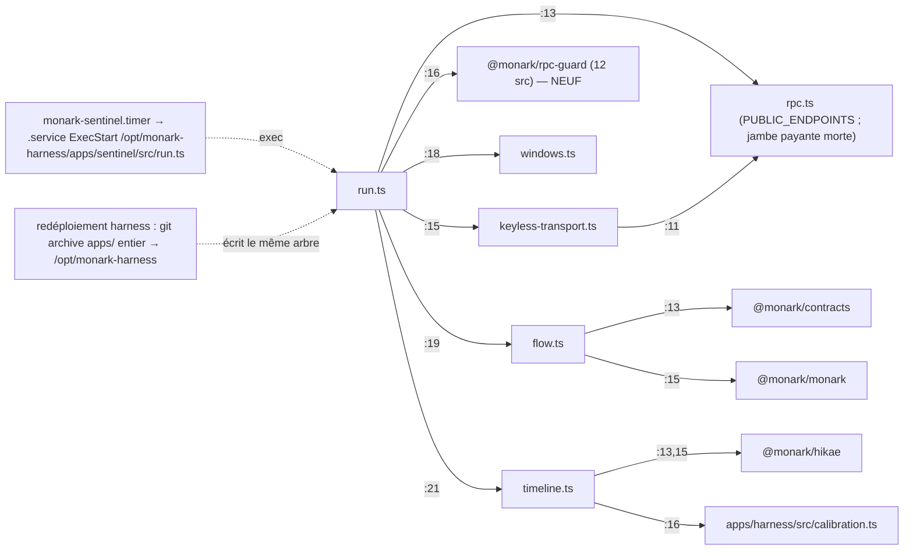
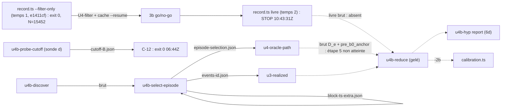

Modèle résolu : claude-opus-5-5[1m]

# CARTOGRAPHIE DE CLÔTURE DE PHASE — clôture du TEMPS 1 de la course Ukemi (recorder `--filter-only`, exit 0 10:41:25Z, N = 15 452) — HEAD `d0535cb` — 2026-09-23

> Worker `claude-opus-5-5[1m]` (effort max) à contexte frais, LECTURE SEULE du dépôt. Sortie = donnée brute pour l'orchestrateur
> (R-21 : à vérifier adversarialement avant consommation). Aucune écriture dans `F:\Monark` ni `F:\Monark-wt-*` ; aucun commit ni
> workflow (R-20) ; toute écriture sous `F:\tmp\carto-t1\` (livrables à la racine, outillage et mesures sous `work\`).
> Règle appliquée : « Branchement » (CLAUDE.md global 2026-09-19 ; ADR-M018 D1-D5) — une pièce n'est `built` que BRANCHÉE (chemin
> servi + test d'intégration non-LLM). Format repris de `docs/carto/CARTOGRAPHIE-TEMPS-1-2026-09-22.md` (§0-§9).
> Chaque chiffre est mesuré dans cette session (commande au §8, donnée dans `graph.json`) ou cité d'un document du dépôt avec
> `fichier:ligne` (fait de journal). Aucun chiffre de seconde main.

## 0. Provenance, portée, méthode

| Élément | Valeur (mesurée) |
|---|---|
| Modèle (R-1) | `claude-opus-5-5[1m]` (préfixe `claude-opus-5-5`, décision 133) |
| Horloge | `date -u` = `2026-09-23T10:48:06Z` au démarrage ; fin au §8 ; Node `v24.15.0` ; TypeScript `6.0.3` (devDependency, pour l'AST) |
| Arbre mesuré | clone `git clone --no-hardlinks --branch lot/etude-suite F:\Monark F:\tmp\carto-t1\clone` puis `git checkout --detach d0535cb638ba87b78c56d48a061e220c1d6a1fd7` ; `git status --porcelain` = 0 ligne (au début et après oracle + 6 portes + export) ; `npm ci --ignore-scripts --cache F:/tmp/npm-cache --no-audit --no-fund` : 283 paquets, journal npm `2026-09-23T10_57_13_697Z` = 273 « cache hit », **0 « http fetch »** ; les 10 points de réparse `node_modules/@monark/*` pointent tous DANS le clone (mesuré) : le clone est supprimable sans risque pour `F:\Monark` |
| Dépôt réel pendant la mission | `F:\Monark` a avancé `d0535cb` → `4a2f69f` → `b07878f` → `7a19224` → `b48311d` → `e5a329b` → `79f1505` : **docs seulement** (`git diff --name-only d0535cb <HEAD> -- apps packages scripts test deploy schemas fixtures .github skills README.md` = vide à `7a19224` (`provenance.json`), à `e5a329b` et à `79f1505` (fin de mission, 11:33:42Z)) ⇒ le graphe mesuré vaut pour `79f1505`. Les faits de course sont cités à `4a2f69f` (`docs/CHANTIERS.md` @ `4a2f69f` l.1076-1082, vérifiés sur objets git par `verify-atcommit.mjs`) ; l'amendement ADR PRE5 est inséré à `7a19224` (après le HEAD mesuré) |
| Bases de comparaison | (1) baseline `4d2efad` : `F:\tmp\carto-t1\{edges,nodes,unresolved}.tsv` + `carto.mjs`, sha re-vérifiés = valeurs M-2 (`93997e09…`, `d84b3c41…`, `f5d6675d…`, `8bc5fd4f…`) ; (2) clôture précédente `7b99737` : `docs/carto/graph-2026-09-22.json` sha `95c11459…` = `F:\tmp\carto\graph.json` (octets identiques) |
| Outils | **`graph.mjs`** (AST TypeScript, `fichier:ligne` par site d'import, vérificateur de citations ; sha `3d73ec99…` INCHANGÉ depuis le 09-22 ⇒ diffs AST↔AST directs ; traitement de CARTO-T1C-6) ; `carto.mjs` (regex, contrôle croisé, sha `8bc5fd4f…`) ; neufs sous `work\` (sha au §8) : `relocate-flows.mjs`, `build-flows.mjs`, `verify-atcommit.mjs`, `diff-prev.mjs`, `coverage2.mjs`, `sentinel-sha.mjs`, `harness-runtime.mjs`, `closures-extra.mjs`, `oracle-check.mjs`, `misc-measures.mjs` |
| Livrables | `CARTO-2026-09-23-temps1.md` (ce fichier) ; **`graph.json`** (sha `37e563e7…`, 504 610 octets ; 364 nœuds, 1 038 arêtes avec lignes, 35 paires, 16 lignes de registre, 12 mesures embarquées avec leur sha256 ; régénération déterministe vérifiée : 2 exécutions ⇒ octets identiques) ; `ecarts.md` ; `insert-proposal.md` ; sha256 finaux au §8 |
| A-7 | tout script/test sous `env -u HELIUS_API_KEY -u CHAINSTACK_ETH_URL -u CHAINSTACK_SOLANA_URL -u CHAINSTACK_BASE_URL -u CHAINSTACK_BSC_URL -u CHAINSTACK_ROBINHOOD_URL -u POLYGON_API_KEY -u DATABENTO_API_KEY` ; aucune valeur d'environnement affichée |
| Réseau et course | **aucun appel réseau** (npm depuis le cache) ; **aucune lecture en ligne** (lecture sur place = acte orchestrateur, règle 2026-09-20) ; **aucun fichier de course ouvert** (`F:\course-ukemi`, `F:\course-bell`, `F:\monark-ledger` non lus : un lecteur tenu peut faire échouer le rename d'un écrivain win32, R-C6-2) ; aucun processus touché ; faits de course = journal du dépôt |
| Préfixe d'items neufs | **CARTO-T1F-n** (« fin du temps 1 de la course ») ; distinct de CARTO-T1-n (baseline) et CARTO-T1C-n (2026-09-22) |
| Portée temporelle | clôture du temps 1 de la **COURSE** (passe de filtre du recorder). La clôture du temps 1 du **PROGRAMME** n'est pas prononcée (`docs/TABLEAU-DE-BORD.md:79` « À VENIR ») : temps 2 arrêté fail-closed 10:43:31Z (INCIDENT REVERT-PAID-1), U-4b-2b / U-5 / U-6 / U-7 à venir |

**Barème (repris de la carto du 2026-09-22 §0, sans redéfinition).** **câblé** = consommateur sur un chemin SERVI (outil MCP/HTTP de
`apps/harness/src/server.ts`, fichier publié lu par une surface, pièce aval servie réelle) ET test d'intégration non-LLM nommé qui
rejoue la composition. **fixture** = aucun chemin servi : `fixture:test` (test/fixture/démo) ou `fixture:course` (script de
course/CLI/procédure) ; les deux valent `upcoming`. **absent** = tuyau annoncé sans code à HEAD. Colonne séparée **déployé/exécuté** :
quel SHA tourne (objets git + journal). Trois vocabulaires tenus séparés : mesure, déployé, labels internes d'ADR (`branché`, `built`
sous la gate reconcile de la décision 129).

**Verdict d'ensemble (données, pas verdict G7).**
1. **Registre public concordant, dans le code ET dans le déployé** pour les surfaces publiques : les 4 `built` de
   `apps/site/lib/fleet.ts` (Shōgen, Hikae, Ukemi, Narabi) ont chacun ≥ 1 chemin servi et leurs tests nommés passent ; oracle complet
   du clone **1058 / 1056 pass / 0 fail / 2 skip** (skips structurels déclarés : SIGTERM win32, artefacts e2 hors dépôt), exit 0 ;
   6 portes exit 0 (`gate:vocab`, `lang:gate`, `export:check`, `typecheck`, `lint`, `lint:ratchet` 69/69) ; **68 tests nommés par les
   paires : 67 pass, 1 skip déclaré, 0 fail, 0 absent**. Déployé = HEAD pour le harness (`bb41b6d`, fermeture servie : 0 fichier
   modifié), le site (`db14e8a` : 0) et la sonde (`c0027cb` : 0). **Aucune surface publique n'a changé depuis `7b99737`** (`git diff`
   sur `apps/site`, `README.md`, `skills`, `apps/harness/README.md`, `schemas` = 0 ligne). Bell : 0 arête entrante, 0 fichier exporté,
   0 fichier dans une fermeture servie, 0 mention publique ⇒ décision 117 tenue.
2. **Graphe** (AST ↔ AST vs `7b99737`) : **+56 arêtes / −0, +11 nœuds / −0**, 100 % attribuées à 8 fusions first-parent (§2.1). Fait
   structurel : **`@monark/rpc-guard` entre dans la fermeture SERVIE de la sentinelle** (32 → 45 fichiers : +12 `packages/rpc-guard/src`,
   +`keyless-transport.ts`) par la fusion -1d `3659181` ⇒ le paquet passe `fixture:course` → **câblé (code)** via P-N5.
3. **ÉCART MAJEUR (déploiement, hors graphe d'imports) — CARTO-T1F-1** : le redéploiement du harness au SHA `bb41b6d`
   (2026-09-23 00:54Z) a expédié `apps/` entier dans `/opt/monark-harness`, qui est AUSSI l'arbre `ExecStart` de la sentinelle ;
   `bb41b6d` contient -1d ⇒ la sentinelle exécute très probablement le code -1d depuis 00:54Z, **hors plan** (production = `c4981d0`
   jusqu'au 2ᵉ redéploiement après P-1..P-4), **hors journal**, dans la fenêtre du créneau 00:30 (P-4), et — si l'`EnvironmentFile` ne
   porte que l'URL — en mode `unconfigured` (7 endpoints keyless, `chainstack=false`, silencieux côté sonde). Non vérifiable sans
   lecture sur place ⇒ 5 contrôles discriminants remis à l'orchestrateur (`ecarts.md`, V-1..V-5). Cause structurelle : **CARTO-T1F-2**.
4. **Course** : le temps 1 a exercé en réel les tuyaux RETRY-2/3 et CONC-1 (arbre `e1411cf` = HEAD sur la fermeture du recorder) ;
   le temps 2 s'est arrêté sur une composition **jamais rejouée par un test** (revert payant nu × tolérance `description()`, paire
   P-U21) — rattachée à UKEMI-REVERT-1 (formé, lancé), non re-formée. Le rendez-vous `built` de CONC-1 (temps 2 à n > 1) n'est pas atteint.
5. **Items** : 3 neufs (T1F-1 majeur, T1F-2 structurel, T1F-3 registre interne) ; CARTO-T1C : **3 clos par mesure** (1, 2, 5),
   1 traité (6), 7 ouverts (3, 4 renforcé, 7 grandi, 8, 9 récidive, 10, 11). **Aucun « dû » nu** (`ecarts.md`).

---

## 1. Inventaire des pièces (état mesuré à `d0535cb`)

Fermetures d'exécution (imports runtime, `import type` exclus ; `graph.json → reachability` et `closures_extra`) : harness servi 46
fichiers, sentinelle servie **45** (32 au 09-22), sonde 1, site 62 ; recorder 35 (33), labeler 17, prober 18, discover 19, select 21,
réducteur+score 26, bin rpc-guard 6, Bell CLI 36 ; neufs : sonde (d) `u4b-probe-cutoff` 22, `u4b-hyp` 5, `u4-redraw` 19,
`bell-report` 1, CA `verify-harness` 1.

### 1.1 Narabi
| Pièce | Code / entrée | Consommateur mesuré | État | Déployé / exécuté (preuve) |
|---|---|---|---|---|
| Sentinelle quotidienne | `apps/sentinel/src/run.ts` ← `deploy/monark-sentinel.service:39` ; écrit `run.ts:358-361` (append `timeline.jsonl`, `state.json`, copies `public/`) | Caddy → `/narabi` + sonde | **câblé** (P-N1) | journal : `c4981d0` (E-5, `docs/JOURNAL-PROVENANCE.md:355`) ; objets git : fermeture `c4981d0..d0535cb` = 17 fichiers, `bb41b6d..d0535cb` = 0 ⇒ **très probablement HEAD depuis 00:54Z** (CARTO-T1F-1) |
| Pool RPC | `run.ts:329` `makeRpcPool({ endpoints, call: makeDispatchCall(leg.client) })` ; clé publique → `keyless-transport.ts` ; `rpc.ts:19` `PUBLIC_ENDPOINTS` | `run.ts` | **câblé** (P-N3) | idem ; la lecture de clé `rpc.ts:54` est du texte MORT sur le chemin servi (0 appelant de `chainstackUrl`/`defaultCall` hors `rpc.ts`) : résiduel 118 fermé dans le code par -1d |
| Jambe Chainstack gardée (-1d) | `run.ts:16` → `@monark/rpc-guard` ; `:285` `unconfigured` ; `:295` `openGuardedClient` ; `:350` `chainstack_guard` | `run.ts` | **câblé (code)** (P-N5) — **absent au 09-22** | fusion `3659181` ; exécution sur le VPS **non planifiée, à vérifier** (CARTO-T1F-1) ; mode prédit `unconfigured` |
| Sonde VPS + mail | `scripts/probe-narabi.mjs` ← `deploy/monark-probe.service:24` | SMTP | **câblé** (P-N2) | `c0027cb` = HEAD (0 fichier) ; n'alerte pas `chainstack_present:false` (ADR-NARABI-OPS-1 item 8) |
| `fromAttestedFlow` → gate stable-run | `flow.ts:15` ; calibration via `timeline.ts:16` | MCP `gate` | **câblé** (P-N4) | harness `bb41b6d` = HEAD |
| Horaire de publication `/narabi` | lit `deploy/monark-sentinel.timer` au build | ligne « lag » | câblé dans le dépôt, **repli** dans le build exporté | `deploy/` : 0 fichier sur 333 exportés ⇒ CARTO-T1C-10 ouvert |
| Arbre de déploiement partagé | `docs/RUNBOOK-harness.md:48,66` (`apps/` entier) ; `docs/RUNBOOK-sentinel.md:26-28` | 2 unités (harness, sentinelle) | **présent, sans test** (procédure, hors barème servi) (P-N7) | exercé 00:54Z au SHA `bb41b6d` ⇒ CARTO-T1F-1/-2 |

### 1.2 Ukemi
| Pièce | Code / entrée | Consommateur mesuré | État | Exécuté / remarque |
|---|---|---|---|---|
| Recorder (`record`, `rpc2`, `resume`, `pool`, `prefetch`, `book`) | CLI `record.ts` : temps 1 `--filter-only` écrit `record.ts:465` ; temps 2 livre `:498`, diag `:530` | 3b go/no-go ; `u4b-reduce --book-raw` | **fixture:course** (P-U6, P-U15, P-U16, P-U20) | arbre de course `e1411cf` = HEAD sur la fermeture du recorder (0 fichier) ; temps 1 exit 0 (N = 15 452) ; temps 2 STOP 10:43:31Z après 182 appels (`CHANTIERS.md` @ `4a2f69f` l.1078, l.1080) |
| Retry 408 / `Retry-After` / battement (RETRY-2/3) | `record.ts:222,385-386,169` | shim d'appel → ledger + diag | **fixture:course** (P-U15) | exercé au temps 1 (drpc 204 erreurs / 26 227 appels, `CHANTIERS.md` @ `4a2f69f` l.1078) |
| Fenêtre bornée `--concurrency` (CONC-1) | `record.ts:251,438,476` ; `pool.ts`, `prefetch.ts` | consommateurs inchangés rejouant des HIT | **fixture:course** (P-U16) | exercé à n = 8 au temps 1 ; rendez-vous `built` (temps 2 à n > 1) **non atteint** |
| Revert payant nu × `description()` | `book.ts:82-92`, `prefetch.ts:46`, `classify.ts:56` | quorum `rpc2.ts:195,205` | **fixture:course, composition non testée** (P-U21) | cause du STOP du temps 2 ⇒ UKEMI-REVERT-1 (formé) |
| Labeler `u3-realized.mjs` | keyless ; payant seulement via `u4-guard.mjs` | `u4b-reduce --labels` | **fixture:course** (P-U5) | `u4b_labels_replay_via_main_real_artifact` SKIP en clone propre (déclaré) |
| Prober `u4-oracle-path.mjs` + ancre pré-B₀ | `--episode-file` ; `raw.pre_b0_anchor` (`u4-oracle-path.mjs:276`) | `u4b-reduce.mjs:66` (gelé) | **fixture:course** (P-U7, P-U18) | étape 5 non atteinte ; arbre `b9964ee` : `rpc2.ts` diffère de HEAD (portail CONC-1, déclaré R-C-5) |
| Discover / select | `u4b-discover.mjs`, `u4b-select-episode.mjs` | select, prober, labeler | **fixture:course** (P-U1..P-U4) | P-U3 : composition réelle rejouée (CARTO-T1C-5 **clos**) |
| Sonde (d) `u4b-probe-cutoff.mjs` | écrit `cutoff-<B>.json` (`:124-125`) | contrôle C-12 (procédure) | **fixture:course** (P-U17) | C-12 exit 0 à 06:44Z (`CHANTIERS.md` @ `4a2f69f` l.1079) |
| `u4b-hyp.mjs report` (STATS-1) | `:676` clause :359, `:685` écriture `wx` | ligne Sidecar 6 → clause U-6 | **fixture:course** (P-U19) | `upcoming` jusqu'à la 1ʳᵉ exécution 6d (item I-4) |
| Réducteur + score gelé + générateur | `u4b-reduce.mjs` → `record-u4b-calib.mjs` | `calibration.ts` (entrées liq) | **absent (annoncé -2b)** (P-U8) | registre liq vide (exécution) |
| Classe servie `liquidation-eligible-coverage` | `apps/harness/src/tools/gate.ts:77,607` | MCP `gate` + `POST /gate` | **câblé**, abstention constante (P-U9) | **déployé** `bb41b6d` (CA 12/12) ⇒ CARTO-T1C-1 **clos** ; description = clause registre-vide ⇒ CARTO-T1C-2 **clos** |
| `cascade` → gate | `registry.ts:85` → `packages/ukemi` | MCP `gate` | **câblé, vacue** (P-U11) | déployé = HEAD |
| `fromRealizedBook` / `ukemi-predict` | non enregistré | tests | **fixture:test** (P-U10) | — |
| AttestedBook | `toAttestedBook` | 0 `src` | **fixture:test** (P-U12) | « upcoming until served » concordant ; CARTO-T1C-4 renforcé |
| Outils MCP | exécution : `REGISTERED_TOOL_NAMES = [gate, cascade, attest, calibrate]` ; openapi `/attest /calibrate /cascade /gate` ; `HARNESS_VERSION 0.4.0` | clients MCP/HTTP | 4 attendus, 4 mesurés | — |

### 1.3 Transverses et Bell
| Pièce | Mesure | État |
|---|---|---|
| `@monark/rpc-guard` | **12 fichiers dans la fermeture SERVIE de la sentinelle** (0 au 09-22) ; 0 dans harness/site/sonde ; consommé aussi par recorder, prober, discover/select, labeler (dyn.), sonde (d), Bell | **câblé (code)** via P-N5 ; `fixture:course` ailleurs ; label interne `upcoming` (décision 129, en-tête `packages/rpc-guard/bin/rpc-guard.mjs:6`) ; aucune surface publique ne le nomme (grep = 0) |
| `packages/{contracts,hikae,monark}` | dans les fermetures harness et sentinelle | **câblé** |
| Export public | `export-public.mjs --out` : 333 fichiers (manifeste compris) ; `apps/bell` 0, `deploy` 0, `docs` 0, `scripts/census` 0 ; `packages/rpc-guard` 26 ; `apps/sentinel/src` 18 | `fixture:course` (P-T3 ; publication = acte orchestrateur) |
| CA de déploiement harness | `scripts/verify-harness.mjs` : 12 contrôles, 0 « sentinel » | **présent, testé** (procédure, hors barème servi) (P-T4) ; périmètre harness seul ⇒ CARTO-T1F-2 |
| Portes CI | rejeu local à HEAD : 6 × exit 0 + oracle vert ; GitHub Actions sous préavis (décision 136) | — |
| Bell collect/quorum/ledger | arbre d'exécution `a703e24` ≠ HEAD (`rebase-crosscheck.ts`, `rpc2.ts` ; déclaré R-SP-C / R-C-5) | **fixture:course** (P-B1) |
| Bell ancrage OTS / sonde | procédural (P-B2) ; aucune unité Bell dans `deploy/` (P-B3) | `upcoming` partout (décision 117) |

---

## 2. Graphe mesuré

### 2.1 Imports (AST) et comparaisons
| Mesure | Baseline `4d2efad` | Clôture préc. `7b99737` | HEAD `d0535cb` |
|---|---|---|---|
| Fichiers de code scannés | 319 | 353 | **364** |
| Arêtes internes distinctes, `carto.mjs` (regex) | 846 | 969 | **1 023** (diff vs baseline : +195 / −18 ; nœuds +46 / −1, `u4-probe.mjs`) |
| Arêtes internes distinctes, `graph.mjs` (AST) | 859 | 982 | **1 038** — import 816, import-type 151, export-from 40, export-type 27, dynamic-import 4 |
| Diff AST ↔ AST vs `7b99737` | — | — | **+56 / −0 arêtes, +11 / −0 nœuds** (`diff_prev_2026_09_22`, 0 non attribuée) |
| Contrôle croisé | — | only_in_ast 13 | only_in_ast **15**, only_in_carto 0 (angle mort `carto.mjs`, CARTO-T1C-6) |
| Imports non littéraux / non résolus | — | 9 / 2 | 9 / 2 (assets `.css`, `.json` ; sha `unresolved.tsv` = baseline) |

**Attribution des 56 arêtes ajoutées** (pickaxe `-S<spécificateur>` sur le fichier source, first-parent `7b99737..d0535cb`) :
| Fusion | Lot | + |
|---|---|---|
| `e1411cf` | UKEMI-CONC-1 (`pool.ts`, `prefetch.ts`, `ukemi-conc.test.ts`) | 18 |
| `3659181` | NARABI-OPS-1d (`run.ts:15-17`, `keyless-transport.ts`, `sentinel-chainstack-guard.test.ts`) | 11 |
| `da5d6e1` | U-4b-1b-4 (`u4b-probe-cutoff.mjs:16-20` + test) | 10 |
| `eab911a` | A-9-OUTILLE (tests `registry.test.ts`, `vocab-harness-a9.test.ts`) | 9 |
| `ec56c35` | HARNESS-DESC-1 (tests `gate-liq.test.ts`, `verify-harness-liq.test.ts`) | 4 |
| `28ffb5b` / `aeeed70` | U-4b-STATS-1 (`u4b-hyp.mjs:36`, test) | 2 + 1 |
| `8ed6226` | UKEMI-PRE5-TESTS (`u4b-chain.test.ts:14` → prober) | 1 |
Nœuds ajoutés (11) : `keyless-transport.ts`, `sentinel-chainstack-guard.test.ts` (-1d) ; `pool.ts`, `prefetch.ts`, `ukemi-conc.test.ts` (CONC-1) ;
`u4b-probe-cutoff.mjs` + test (1b-4) ; `u4b-hyp.mjs` + test (STATS-1) ; `verify-harness-liq.test.ts` (HARNESS-DESC-1) ;
`vocab-harness-a9.test.ts` (A-9). UKEMI-RETRY-2/3 (`12b6dcd`) et BELL-SHORTPAGE-1 (`2c276bb`) ne changent aucune arête.

### 2.2 Sous-graphes `src → src` (chaque arête avec sa ligne ; liste complète : `graph.json → import_edges[].lines`)

**Narabi servi (HEAD)** — le seul changement structurel du périmètre servi :


**Ukemi — recorder (HEAD)** : `record.ts:20 → rpc2.ts`, `:24 → @monark/rpc-guard`, `:25 → book.ts`, `:28 → resume.ts`, **`:30 → pool.ts`,
`:31 → prefetch.ts`** (CONC-1) ; `prefetch.ts:8-13 → abi/clusters/book/rpc2/resume/pool` ; `rpc2.ts:13 → ../rpc.ts`, `:20 → @monark/rpc-guard` ;
`book.ts:12 → @monark/monark` ; `abi.ts:7 → ../rpc.ts`. **Outils de course** : `u4b-probe-cutoff.mjs:16 → rpc2.ts`, `:17 → abi.ts`,
`:18 → u4-guard.mjs`, `:19 → u4-oracle-path.mjs`, `:20 → u4b-discover.mjs` ; `u4b-hyp.mjs:36 → u4b-scores.mjs` ; inchangés :
`u4-oracle-path.mjs → u4-guard.mjs → @monark/rpc-guard`, `u3-realized.mjs → u4-guard.mjs` (dynamique).

**Flux d'artefacts de la course (exécution, pas imports)** :


**Couplage Bell → sentinelle** (inchangé) : Bell consomme `apps/sentinel/src/rpc.ts` et `ukemi/rpc2.ts`, jamais l'inverse ; arêtes
entrant dans `apps/bell` depuis l'extérieur : **0**.

### 2.3 Accessibilité depuis les points d'exécution
| Point d'entrée | Fichiers chargés | `@monark/rpc-guard` | `apps/bell` | Exécuté au SHA |
|---|---|---|---|---|
| SERVI harness (`server.ts`) | 46 | 0 | 0 | `bb41b6d` = HEAD (0 fichier) |
| SERVI sentinelle (`run.ts`) | **45** (32) | **12** (0) | 0 | journal `c4981d0` ; objets git : `bb41b6d` probable (T1F-1) |
| SERVI sonde (`probe-narabi.mjs`) | 1 | 0 | 0 | `c0027cb` = HEAD |
| SERVI site (`apps/site/app/**`) | 62 | 0 | 0 | `db14e8a` = HEAD |
| CLI recorder / prober / sonde (d) | 35 / 18 / 22 | 12 / 12 / 12 | 0 | `e1411cf` / `b9964ee` / — |
| CLI Bell | 36 | 12 | — | `a703e24` |

### 2.4 Flux à l'exécution — chaque paire producteur → consommateur
(Citations vérifiées par `graph.mjs` : `curated_citations_failed = 0` ; citations à d'autres commits : `verify-atcommit.mjs`, 11 vérifiées,
0 échec ; issues d'oracle des 68 tests nommés : `oracle-check.mjs`.)

| # | Producteur → artefact → consommateur | État | Test d'intégration non-LLM | Déployé / exécuté |
|---|---|---|---|---|
| P-N1 | `run.ts:358-361` → `public/{timeline.jsonl,state.json}` → Caddy → `/narabi` | **câblé** | `narabi_live_parses_real_state_shape` (`test/narabi-live.test.ts:50`) | probable `bb41b6d` (T1F-1) ; effet prédit : provenance seule (`sentinel_sha`, endpoints 8 → 7), `line_hash` inchangé |
| P-N2 | `/narabi/*` → sonde → `narabi.json` → SMTP | **câblé** | `probe_state_mismatch_drives_smtp_alert_merged` et 2 autres (inchangés) | `c0027cb` = HEAD |
| P-N3 | pool `run.ts:329` (keyless `keyless-transport.ts` + label payant → garde) → `run.ts` | **câblé** | `pool_rpc_1a_l1_pocket_through_unchanged_anchor`, `sentinel_chainstack_url_alone_degrades_to_keyless` (`apps/sentinel/test/sentinel-retry.test.ts:245`), `sentinel_chainstack_guard_ok_ledgers_publishes_origin_and_releases_lock` (`apps/sentinel/test/sentinel-chainstack-guard.test.ts:226`) | T1F-1 |
| P-N4 | `flow.ts:15` + calibration USDe → `gate` | **câblé** | `gate_stable_run_usde_committed_region_A7b` | `bb41b6d` = HEAD |
| P-N5 | `run.ts:16,295` → `@monark/rpc-guard` (jambe Chainstack gardée ; `unconfigured` `:285`) | **câblé (code)** — était **absent** | `sentinel_chainstack_origin_absent_is_unconfigured` (`apps/sentinel/test/sentinel-chainstack-guard.test.ts:289`), `sentinel_guard_open_failure_degrades_to_keyless_and_publishes` (`apps/sentinel/test/sentinel-chainstack-guard.test.ts:257`) + 2 ci-dessus | **non planifié, à vérifier** (T1F-1) |
| P-N6 | `deploy/monark-sentinel.timer` → `/narabi` (au build) | dépôt : câblé ; export : **repli** | aucun | CARTO-T1C-10 |
| P-N7 | redéploiement harness (`apps/` entier) → `/opt/monark-harness` → 2 unités | **présent, sans test** (procédure) | **aucun** (CA sans contrôle sentinelle) | exercé 00:54Z (T1F-1, T1F-2) |
| P-U1/U2/U4 | discover → select ; `--fill-ts` → sidecar ; select → events → labeler | fixture:course | `u4b_chain_discover_to_select_far_from_e2`, `u4b_chain_e2_adjacent_missing_ts_resolved_by_fill_ts`, `u4b_select_events_compose_with_the_labeler_parseArgs_and_predicate` | — |
| P-U3 | select `:228,:233` → `episode-selection.json` → prober `:145,:93` | fixture:course | **`u4b_chain_select_to_oracle_path` (`apps/sentinel/test/u4b-chain.test.ts:158`)** — composition réelle ⇒ CARTO-T1C-5 **clos** | C-12 passé ; étape 5 à venir |
| P-U5 | labeler → `U3-realized.jsonl` → réducteur | fixture:course | `u4b_labels_replay` ; `…_via_main_real_artifact` SKIP (clone propre) | — |
| P-U6 | recorder → livre + diag → `u4b-reduce --book-raw` | fixture:course | `ukemi_record_then_unlock_then_reconcile_end_to_end`, `ukemi_record_budget_stop_writes_durable_diag_journal` | temps 2 arrêté : aucun livre réel |
| P-U7 | prober → brut D_e → réducteur | fixture:course | `u4_oracle_path_spends_only_through_guard`, `u4_oracle_path_e2_via_flags_is_deterministic_and_reproduces_the_De_data` | — |
| P-U8 | réducteur → scores → générateur → `calibration.ts` | **absent (-2b)** | `u4b_registry_recomputes_from_scores_jsonl` (générateur) | — |
| P-U9 | score e2 → `gate` classe liq | **câblé**, abstention | `u4b_gate_serves_region_from_real_artifact` | **déployé** (T1C-1 clos) |
| P-U10 / U12 | `fromRealizedBook` → `ukemi-predict` ; `toAttestedBook` → ∅ | fixture:test | `u5_producer_predicts_then_gate_abstains_under_calib` ; `attested_book_composition` | — |
| P-U11 | `packages/ukemi` → `cascade` → gate | **câblé, vacue** | `probe_harness_records_real_decision` | déployé = HEAD |
| P-U13 | ledger → `reconcile`/`unlock` (bin) | fixture:course | `ukemi_record_e2e_paid_ledger_is_reconciled_go_and_hard_no_go`, `u4_oracle_path_ledger_reconciles_through_served_runcli` | en vol : `repair-tail` (GARDE-FSYNC-1, §6) |
| P-U14 | client budgété → recorder/prober/…/Bell **+ sentinelle servie** | **câblé (code)** + fixture:course | `ukemi_record_spends_only_through_guard`, `u3_paid_archive_operator_wired_with_allow_paid` | — |
| P-U15 | `HttpError` 408 / `retryAfterMs` → retry en place (`record.ts:386`) → ledger + diag + battement | fixture:course | `ukemi_record_retry2_drpc_408_is_retried_in_place_course_topology_survives` (`apps/sentinel/test/ukemi-guard-record.test.ts:714`) + 6 (`:744`, `:773`, `:797`, `:820`, `:857`, `:877`) | exercé au temps 1 |
| P-U16 | `--concurrency` → préfetch borné → lecteur mémoïsant → consommateurs inchangés | fixture:course | `ukemi_conc_n8_filter_and_book_are_byte_identical_to_n1` (`apps/sentinel/test/ukemi-conc.test.ts:218`) + 6 | temps 1 à n = 8 ; `built` non atteint |
| P-U17 | sonde (d) → `cutoff-<B>.json` → C-12 | fixture:course | `u4b_probe_cutoff_go_when_equal_real_form_logs_full_range_and_C12_exit_0` (`apps/sentinel/test/u4b-probe-cutoff.test.ts:76`), `u4b_probe_cutoff_c12_constant_is_the_runbook_control_verbatim` (`apps/sentinel/test/u4b-probe-cutoff.test.ts:351`) + 3 | exercé (C-12 exit 0) |
| P-U18 | prober → `pre_b0_anchor` → réducteur gelé → scoreur | fixture:course | `u4b_anchor_and_usdt_blocks_compose_prober_to_frozen_reducer_and_scorer` (`apps/sentinel/test/u4b-oracle-path.test.ts:390`) + 1 | étape 5 à venir |
| P-U19 | `u4b-hyp report` → `hyp-report-<EP>.json` → Sidecar 6 / clause :359 | fixture:course | `u4b_hyp_report_e2_end_to_end_deterministic_body_digest` (`apps/sentinel/test/u4b-hyp.test.ts:582`) + 3 | étape 6d à venir |
| P-U20 | temps 1 (`U4-filter-<B>.json` + cache) → 3b → temps 2 (`--resume`) | fixture:course | `ukemi_conc_resume_under_concurrency_one_line_per_miss_and_replays` (`apps/sentinel/test/ukemi-conc.test.ts:274`), `ukemi_record_parses_cli_args` | T1 exit 0 ; 3b GO ; T2 STOP |
| P-U21 | `description()` revert NU sur {drpc keyless, chainstack payant} → quorum → tolérance `ConcordantRevertError` | fixture:course, **composition non testée** | mécanisme épinglé par morceaux : `paid_revert_with_empty_0x_data_is_benched` (`apps/sentinel/test/ukemi-guard-classify.test.ts:91`), `u4_oracle_path_paid_leg_is_metered_in_its_own_ledger` (`test/guard-scripts-u4.test.ts:290`), `ukemi_budget_counts_http_attempts_and_caller_retry_is_scoped` (`apps/sentinel/test/ukemi-guard-record.test.ts:182`) | STOP temps 2 ⇒ UKEMI-REVERT-1 |
| P-B1/B2/B3 | Bell collect → ledgers durables → rapport ; OTS ; sonde Bell | fixture:course / procédural / absent | inchangés | `a703e24` |
| P-T1/T2 | `attest` → gate (`attested`) ; hikae → gate/calibrate | **câblé** | `gate_attested_concordant_files_residual`, `probe_harness_records_real_decision`, … | **déployé** `bb41b6d` |
| P-T3 | export public → miroir | fixture:course | `export_public_no_governance_no_french` | acte orchestrateur |
| P-T4 | CA `verify-harness.mjs` → `docs/deploy-CA-harness.json` | **présent, testé** (procédure) | `verify_harness_ca_passes_on_the_in_process_harness` (`test/verify-harness-liq.test.ts:52`), `verify_harness_ca_liq_checks_red_on_overclaiming_surfaces` (`test/verify-harness-liq.test.ts:132`) | exécutée 00:54Z (12/12) ; périmètre harness seul |

---

## 3. Registre public × état mesuré

| # | Surface : revendication | Mesure à `d0535cb` | Verdict |
|---|---|---|---|
| R-1 | `apps/site/lib/fleet.ts:123` Shōgen `built` (attest → gate) | câblé (P-T1) ET déployé (`bb41b6d`) | **concordant** (T1C-1 clos) |
| R-2 | `fleet.ts:138` Hikae `built` | câblé (P-T2), déployé | concordant |
| R-3 | `fleet.ts:161` Ukemi `built` : cascade → gate, abstient | câblé, vacue (P-U11), déployé | concordant |
| R-4 | `fleet.ts:189` Narabi `built` : timeline publiée + `fromAttestedFlow` → gate | câblé (P-N1, P-N4) ; code producteur exécuté probablement ≠ journal (T1F-1) mais la revendication publique (publication quotidienne) reste vraie dans les deux cas | concordant (écart de déploiement porté par T1F-1, pas par le registre) |
| R-5 | `README.md:42` endpoint public 4 outils | exécution : 4 enregistrés, 4 routes | concordant |
| R-6 | `README.md:117` AttestedBook « upcoming until served », « keyless RPC quorum » | 0 consommateur src ; recorder à membre payant (`record.ts:309`) ET dépense réelle au temps 1 | upcoming concordant / **T1C-4 renforcé** |
| R-7 | `skills/monark/SKILL.md:3,58` quatre outils ; classes | 4 outils ; 4ᵉ classe non nommée (retard déclaré 2b-7) | concordant / T1C-3 |
| R-8 | `apps/harness/README.md:14,27` entrée `{prediction, params}` | entrée mesurée `[prediction, params, attested]` | **écart ouvert T1C-3** (inchangé) |
| R-9 | `apps/site/lib/ukemi-copy.ts:102` classe liq « served through the gate » | vrai en code ET servi (CA `gate_liq_call` verte) | **concordant** (T1C-1 clos) |
| R-10 | description servie de `gate` (`gate.ts:220`) | registre vide ⇒ clause registre-vide, pas de phrase H-3 (exécution) ; 2 962 unités UTF-16 = 2 983 octets UTF-8 (la valeur « 2 983 caractères » du journal compte des octets) | **concordant** (T1C-2 clos) |
| R-11 | `/narabi` pilule (`apps/site/lib/narabi-live.ts:304`) | N lu du `state.json` en ligne, repli instantané | concordant |
| R-12 | Bell dans tout registre public (décision 117) | 0 mention, 0 export, 0 fermeture servie, 0 arête entrante, 0 unité | concordant |
| R-13 | `apps/site/app/roadmap/page.tsx:40` AttestedBook upcoming | P-U12 | concordant |
| R-14 | commentaires `fleet.ts:163` (lignes de test périmées) | inchangé | T1C-8 ouvert |
| R-15 | panneaux `status="built"` littéraux (`apps/site/components/narabi-panel.tsx:35`) | inchangé | T1C-11 ouvert |
| R-16 | `docs/TABLEAU-DE-BORD.md:3,42` (registre INTERNE) « mis à jour à CHAQUE événement » ; -1d « EN COURS » | dernière édition `153582f` ; -1d fusionné `3659181` ; 124 commits first-parent depuis | **écart interne → CARTO-T1F-3** |

Aucune surface publique ne revendique `built` pour une pièce non branchée ; aucune n'a changé depuis `7b99737`.

---

## 4. Chemins payants et couverture de la garde CI (`coverage2.mjs`, racines transcrites de `test/rpc-guard-fetch-only-inside-client.test.ts` À `d0535cb`)

Racines : `packages/*/src` (allowlist `transport.ts`) ; `apps/bell/src` (allowlist `close.ts`) ; **`apps/sentinel/src/**`** (élargie par
-1d ; allowlist `rpc.ts` + `keyless-transport.ts`, `test/rpc-guard-fetch-only-inside-client.test.ts:108-111`) ; `scripts/census/u4-*.mjs`
**non récursive** (`:122-126`, allowlist vide). 206 fichiers dans le périmètre ; 14 portent un site réseau ou une lecture de clé :

| Fichier : lignes | Nature | Racine CI |
|---|---|---|
| `packages/rpc-guard/src/transport.ts:93,96,106` (clés), `:220-221` (fetch) | garde | `packages/*/src` [allowlisté] |
| `apps/bell/src/close.ts:43` (clés), `:186,201` (fetch) | Bell cash (temps 2) | `apps/bell/src` [allowlisté] |
| `apps/sentinel/src/rpc.ts:54` (clé, **morte sur le chemin servi**), `:125` (fetch) | Narabi | `apps/sentinel/src/**` [allowlisté, retrait au rebase -1d] |
| `apps/sentinel/src/keyless-transport.ts:27` (fetch) | Narabi keyless (neuf) | `apps/sentinel/src/**` [allowlisté] |
| `scripts/census/u3-realized.mjs:310` ; `aave-liquidations.mjs:122` ; `burns-by-burner.mjs:106` ; `scripts/usde-full-pull.mjs:63` | census keyless | **aucune** |
| `scripts/probe-narabi.mjs:277,648-649` ; `scripts/verify-harness.mjs:24-25,103` ; `release-public.mjs:26` ; `sbom.mjs:13` | GET public / SMTP / CA / git / npm | **aucune** |
| `apps/harness/src/server.ts:24,164` ; `apps/site/components/narabi/narabi-live.tsx:52` | serveur ; fetch navigateur | **aucune** |

**Résultat** : toutes les lectures de clé du code sont dans une racine et allowlistées ; **0 lecture de clé hors racine**
(`uncovered_with_key_read = []`). `scripts/census/**` : **10/15 fichiers hors de toute racine**, dont les 7 `u4b/*.mjs` (deux neufs depuis
le 09-22 : `u4b-hyp.mjs`, `u4b-probe-cutoff.mjs` ; ce dernier a son propre test B-5
`u4b_probe_cutoff_script_is_keyless_clean_and_imports_closed` (`apps/sentinel/test/u4b-probe-cutoff.test.ts:325`)) ⇒ **CARTO-T1C-7 ouvert, grandi**.

---

## 5. Tuyaux déclarés par les ADR des lots du jour — présents / testés / absents (mission point 5)

| Lot (fusion) | Ancre ADR (`docs/adr/ADR-U4b-calibration-episode-frais.md` sauf mention) | Tuyaux déclarés → paire | Présent | Testé (oracle `d0535cb`) | Rendez-vous déclaré |
|---|---|---|---|---|---|
| UKEMI-RETRY-2/3 + HEARTBEAT-1 (`12b6dcd`) | `:1828` (Tuyaux `:1846-1850`) | 408 transitoire, `Retry-After`, battement → P-U15 | oui (`record.ts:222,385-386,169`) | 7/7 pass | exercé au temps 1 réel |
| UKEMI-CONC-1 (`e1411cf`) | `:1861`, §4 `:1950` | fenêtre bornée → consommateurs inchangés → P-U16 | oui (`pool.ts`, `prefetch.ts`, `record.ts:251,438,476`) | 13 tests, 7 nommés : 7/7 pass | `built` à la 1ʳᵉ course rapprochée « temps 2 à n > 1 » : **non atteint** (T2 arrêté après 182 appels) — état, pas dette |
| UKEMI-PRE5-TESTS (`8ed6226`) | amendement v3 inséré à `7a19224` (après le HEAD mesuré) | P-U3 (sélecteur → prober) ; C12-PIN | oui (test) | `u4b_chain_select_to_oracle_path` pass ; `u4b_probe_cutoff_c12_constant_is_the_runbook_control_verbatim` pass | statut `fixture:course` inchangé (déclaré) ; CARTO-T1C-5 clos |
| GARDE-FSYNC-1 pli 4 | fold hors dépôt (`F:\tmp\gfsync1-fold\ADR-amendement-GARDE-FSYNC-1-final.md`, table Tuyaux) | append durable, retry rename, `repair-tail` servi → `<op>.repair.jsonl` → `reconcile` NO-GO `repaired_in_window` | **absent à HEAD** (lot NON fusionné, `lot/garde-fsync-1` @ `9ea2e8b`) | sur la pointe du lot (objets git) : 5 tests nommés présents (`durable.test.ts:23,122`, `repair-tail.test.ts:42,214,265`) ; non exécutés ici | en vol (re-G2-delta pli 4) ; `@monark/rpc-guard` reste `upcoming` au registre (décision 129) |
| U-4b-STATS-1 (`28ffb5b`, `aeeed70`, `b9964ee`) | `:1496`, §6 `:1644` | `u4b-hyp report` → Sidecar 6 → clause :359 → P-U19 | oui | 4/4 nommés pass | `upcoming` jusqu'à la 1ʳᵉ exécution 6d (I-4) |
| (aussi) NARABI-OPS-1d (`3659181`) | ADR-NARABI-OPS-1, amendement -1d | jambe Chainstack gardée → P-N5, P-N3 | oui | 4/4 nommés pass | 2ᵉ redéploiement après P-1..P-4 : **contourné de fait** (CARTO-T1F-1) |
| (aussi) U-4b-1b-4 (`da5d6e1`) | `:1298`, §3 `:1369` | sonde (d), ancre pré-B₀, `--usdt-blocks` → P-U17, P-U18 | oui | pass | sonde (d) exercée (C-12 exit 0) |
| (aussi) HARNESS-DESC-1 (`ec56c35`) | `:1056` | description conditionnelle → P-U9 / R-10 | oui | pass | **déployé** (`bb41b6d`) |

Les lignes de test citées dans les amendements STATS-1 (« tests @ `c1e9e30` ») et 1b-4 (« @ `206bc56` ») sont datées : leurs titres
existent à HEAD (dérive de ligne +7/+8, sans incidence ; le gel du registre apparie par NOM).

---

## 6. Lots en vol (hors chiffres HEAD)
| Lot | Pointe / base | Delta de graphe (AST, lot seul) | Effet de branchement |
|---|---|---|---|
| GARDE-FSYNC-1 | `9ea2e8b` / base `66f75c2` | **+14 / −1 arêtes, +4 nœuds** (`repair.ts`, `durable.test.ts`, `no-fsync.ts`, `repair-tail.test.ts`) ; `cli.ts:8 → repair.ts` | une fois fusionné, `repair.ts` entre dans la fermeture SERVIE de la sentinelle (via `run.ts` → index → `cli.ts`) et dans celle du bin ; son item I-1 (fsync du parent, déclencheur « avant le 2ᵉ redéploiement ») voit sa prémisse changée si T1F-1 est confirmé |
| UKEMI-REVERT-1 | `4a2f69f`, 0 commit | — | option A' de l'advisor (`b07878f`) ; la composition à tester est mesurée (P-U21) |
| BELL-ADV-1 | `d0535cb`, 0 commit | — | temps 2 (Bell), hors registre public |

---

## 7. Écarts → items (détail, formes et déclencheurs : `ecarts.md`)
- **CARTO-T1F-1 (majeur, déploiement)** — redéploiement harness `bb41b6d` = 2ᵉ redéploiement sentinelle de fait ; vérification sur
  place (V-1..V-5 : `run.ts` `45557d6e…` vs `54619a40…` ; clé `chainstack_guard` au journal ; compte des clés de cycle ; `sentinel_sha`
  `e73866a8…` vs `a3ed49f4…` ; `Result`/`ExecMainStatus` de l'unité, qui sépare `unconfigured` d'un import échoué) puis ruling parmi
  R-a/R-b/R-c. P-2 et P-4 sont fausses par les faits ; P-1 est non tenue par inférence mesurée (`rpc.ts` toujours au sha gelé
  `0e232519…` à `bb41b6d` et `d0535cb`, alors que le pli §11-1 est la suppression de son code mort, ADR-U4b `:742-744`).
- **CARTO-T1F-2 (structurel)** — un arbre pour deux unités ; recherche de solutions S-1..S-4 (précédents : `/opt/monark-probe`,
  `/opt/monark-app` + swap atomique, hachés attendus d'E-5).
- **CARTO-T1F-3 (registre interne)** — `TABLEAU-DE-BORD.md` figé depuis 2026-09-22T20:28Z.
- CARTO-T1C : **clos** 1, 2, 5 ; **traité** 6 ; **ouverts** 3, 4 (renforcé), 7 (grandi), 8, 9 (récidive `d55fbb7`), 10, 11.
- Existants rappelés : UKEMI-REVERT-1 (composition P-U21 mesurée pour son G0), PROV-MODEL-1 (le brut du temps 1 porte
  `claude-opus-4-8[1m]`, `record.ts:410,455,488`), K-1 (`apps/sentinel/src/flow.ts:52`), rendez-vous `built` de CONC-1, GARDE-FSYNC-1 I-1.
- Fait postérieur au HEAD mesuré (`e5a329b`, docs seulement, 0 fichier de code depuis `d0535cb`) : la **décision 145** (charte Bell sur
  le site entier, pages `bell` et `bell/method` comprises) EST le « prochain lot `apps/site` » qui déclenche T1C-8/-10/-11 ; ce lot devra
  rejouer R-12 (Bell `upcoming`, décision 117) et R-15 (aucun statut recopié en littéral). Sa question Q3 (« Bell dans `PRODUCTS` »,
  `docs/CHANTIERS.md` @ `79f1505`) heurte le gel `fleet_register_built_set_is_frozen` (`test/ci-gates.test.ts:800` : 5 produits, tous
  `upcoming`, `:822-825`) : tout ajout exige l'amendement de ce test et le statut `upcoming`.

---

## 8. Commandes rejouables (toutes depuis `F:\tmp\carto-t1\work\`, env A-7 noté `$E`) et sha256 des livrables
```
E="env -u HELIUS_API_KEY -u CHAINSTACK_ETH_URL -u CHAINSTACK_SOLANA_URL -u CHAINSTACK_BASE_URL -u CHAINSTACK_BSC_URL -u CHAINSTACK_ROBINHOOD_URL -u POLYGON_API_KEY -u DATABENTO_API_KEY"
GIT_OPTIONAL_LOCKS=0 git clone --no-hardlinks --branch lot/etude-suite F:/Monark F:/tmp/carto-t1/clone && git -C ../clone checkout --detach d0535cb638ba87b78c56d48a061e220c1d6a1fd7
cd ../clone && $E npm ci --ignore-scripts --cache F:/tmp/npm-cache --no-audit --no-fund && cd ../work     # 283 paquets, 0 http fetch
node carto.mjs F:/tmp/carto-t1/clone carto-out                                                            # 364 fichiers, 1023 arêtes
node graph.mjs F:/tmp/carto-t1/clone _run1 --head d0535cb… --carto carto-out/edges.tsv --baseline ../edges.tsv --baseline-nodes ../nodes.tsv
node diff-prev.mjs F:/tmp/carto-t1/clone F:/Monark/docs/carto/graph-2026-09-22.json _run1/graph.json 7b99737… d0535cb… > diff-prev.json   # +56/-0, 8 fusions
node relocate-flows.mjs F:/tmp/carto-t1/clone F:/tmp/carto/flows.json flows-relocated.json > relocate-report.json                        # 129 gardées, 23 déplacées, 3 réécrites
node build-flows.mjs flows-relocated.json flows-2026-09-23.json && node verify-atcommit.mjs F:/tmp/carto-t1/clone flows-2026-09-23.json   # 11/11
node sentinel-sha.mjs F:/tmp/carto-t1/clone c4981d0 3659181^ 3659181 bb41b6d e1411cf d0535cb > sentinel-sha.json
$E node harness-runtime.mjs F:/tmp/carto-t1/clone > harness-runtime.out.json
node coverage2.mjs F:/tmp/carto-t1/clone > coverage2.out.json
git -C ../clone archive 9ea2e8b | tar -x -C inflight/gfsync1-tip ; git -C ../clone archive 66f75c2 | tar -x -C inflight/gfsync1-base      # puis graph.mjs --ts-from ../clone sur chacun
cd ../clone && $E TEMP=F:\tmp\carto-t1\work\os-tmp node --test --test-timeout=120000 --test-force-exit --test-reporter=tap "test/*.test.ts" "packages/*/test/*.test.ts" "apps/harness/test/*.test.ts" "apps/sentinel/test/*.test.ts" "apps/bell/test/*.test.ts" > ../work/test-full.tap   # 1058/1056/0/2, exit 0, tap 8ca8ca8b…
cd ../clone && for s in gate:vocab lang:gate export:check typecheck lint lint:ratchet; do $E npm run --silent $s; done   # 6 × exit 0
cd ../clone && $E node scripts/export-public.mjs --out F:/tmp/carto-t1/work/export-out                    # 333 fichiers
node oracle-check.mjs test-full.tap flows-2026-09-23.json > oracle-check.out.json                          # 68 nommés : 67 pass, 1 skip
node closures-extra.mjs _run2/graph.json > closures-extra.out.json && node misc-measures.mjs F:/tmp/carto-t1/work F:/tmp/carto-t1/clone F:/Monark
$E node graph.mjs F:/tmp/carto-t1/clone F:/tmp/carto-t1 --head d0535cb… --carto carto-out/edges.tsv --baseline ../edges.tsv --baseline-nodes ../nodes.tsv \
   --flows flows-2026-09-23.json --embed diff_prev_2026_09_22=diff-prev.json --embed coverage=coverage2.out.json --embed oracle_named_tests=oracle-check.out.json \
   --embed gates=gates.json --embed export=export.json --embed harness_runtime=harness-runtime.out.json --embed sentinel_sha=sentinel-sha.json \
   --embed closures_extra=closures-extra.out.json --embed verify_atcommit=verify-atcommit.out.json --embed inflight_gfsync1=inflight-gfsync1.json \
   --embed provenance=provenance.json --embed relocate_report=relocate-report.json                        # graph.json ; 2ᵉ exécution vers _det : octets identiques
node verify-md.mjs F:/tmp/carto-t1/clone ../CARTO-2026-09-23-temps1.md ; node verify-md.mjs F:/tmp/carto-t1/clone ../ecarts.md
git -C F:/Monark --no-optional-locks status --porcelain | wc -l                                             # 0
```
Mesures ponctuelles : `git merge-base --is-ancestor 3659181 bb41b6d` (vrai) ; `TZ=UTC git log -1 --format=%cd` de `3659181` (20:53:39Z),
`bb41b6d` (00:52:21Z), `153582f` (20:29:10Z) ; `git diff --name-only <SHA déployé> d0535cb -- <fermeture>` (harness 0, sentinelle
`c4981d0` 17 / `bb41b6d` 0, sonde 0, site 0, recorder `e1411cf` 0, prober `b9964ee` 1, Bell `a703e24` 2) ; `git rev-list --count
--first-parent 153582f..d0535cb` (124).

**sha256** (outils et mesures sous `F:\tmp\carto-t1\work\` ; les sha des fichiers `.md` livrés, qui ne peuvent se contenir
eux-mêmes, sont dans `insert-proposal.md` et dans le message de rendu) :
```
3d73ec9936d13e24de8ce849edfa513369dea4038c60bedda34b293d83001ded  graph.mjs            (inchangé depuis le 2026-09-22)
8bc5fd4f422f9d4ec2ef72a63927ed8b0eee29ffe010990f5fc9c234032f7632  carto.mjs            (= M-2 baseline)
3178619f573ad9dce5ca53783de94aa572577a4f9635a8ec44d9df86f6d39ad6  relocate-flows.mjs
c04cb7d8a4af38681dd335aecd4122736a4810f1e11116bca6a61afba6789067  build-flows.mjs
e8c8489f5faf8f4b1f9f120db3f77007e09422498a57f1cd674a8bc9db5ed5ff  verify-atcommit.mjs
b1fd09ab6f5cb3ea35e2539075664df180ee9311c197f42c754318f314917360  diff-prev.mjs
f392a41f18f77d27d7f0c0ac1b7e7d2abc8cecaf583d491fd66ffa2309c94ba5  coverage2.mjs
c0fcc1834a2c004318772c04aab82e1ff3005e43a1176ac761ffdac8c78bde39  sentinel-sha.mjs
10bf2af0e412097754ba8d5a85e7fe510fa5165c42f732d3bf030801d9fb79ad  harness-runtime.mjs
2e6d672196f22899c1d449b3a9060b8c6d8f35e23285b1017a5fdd95f6fb9554  closures-extra.mjs
ecd283efb259fb6c17bb6e0fd5ff5f503cf2583f50c663d700fe4bac52eff3c0  oracle-check.mjs
0fc021ea62a4236b5eca7c38d65d0dc4e4e45c510494edb5202f708815769637  misc-measures.mjs
7d35ba1020d06a8495e71d629474d7589d4a4a7ff18fecdf27f93e71fe425c37  md-extra-check.mjs    (54 contrôles de CONTENU des références .md hors flows : 0 échec)
30878c77c3aba3472140991e7dda5eb0530e0875dfc63819c8a4f2f32852bbda  verify-md.mjs        (plages de lignes + titres de test des 3 .md : 137 + 51 + 12 contrôles, 0 échec)
358d6464b78f2d5874a7ab39630b82736851ac6693f0ed461b5ef4dd40023487  flows-2026-09-23.json
8ca8ca8b1442b22618c1e61c1728423cbf6e760f82551ec408fe24a310fb0676  test-full.tap        (1058/1056/0/2)
37e563e7fc991c65e4163ed1489e100386a95e7cdd8bd4c21d3a2002c0c8a323  ../graph.json        (livrable ; 504 610 octets ; déterministe : 2 exécutions, octets identiques)
```
**Horloge de fin** : `date -u` = `2026-09-23T11:33:42Z` (début `10:48:06Z`) ; `git -C F:/Monark --no-optional-locks status --porcelain`
= 0 ligne ; HEAD `F:\Monark` = `79f1505`, 0 fichier de code modifié depuis `d0535cb` ; aucun worktree `F:\Monark-wt-*` touché.

## 9. Limites déclarées
- **Aucune mesure en ligne** (règle : lecture sur place = acte orchestrateur) : l'état réel du VPS (octets de `run.ts`, JSON de fin,
  contenu de l'`EnvironmentFile`) n'est établi que par objets git + journal ; CARTO-T1F-1 porte les 5 contrôles qui tranchent.
- Dans `flows-2026-09-23.json`, les paires de PROCÉDURE (P-N7, P-T4) portent un statut « present … (procedure; outside the
  served-path bareme: not 'cable') » : le barème câblé/fixture/absent ne s'applique qu'aux chemins servis.
- Faits de course (N, appels, STOP, C-12) = journal du dépôt (`CHANTIERS.md` @ `4a2f69f`), aucun fichier de course lu.
- Fermetures **statiques** (imports d'exécution) : 9 imports non littéraux (tests, `s2-report.mjs`, `assert-fleet-html.mjs`) inspectés,
  aucun ne relie une pièce Ukemi/Bell à un point d'entrée servi.
- Tests nommés vérifiés par existence ET issue dans l'oracle du clone (win32) ; leur pouvoir de détection (mutants) n'est pas
  ré-établi ici (il l'a été aux G2/checkpoints des lots cités). Les tests du lot en vol GARDE-FSYNC-1 sont vérifiés par existence sur
  objets git seulement.
- Le skip `u4b_labels_replay_via_main_real_artifact` est structurel en clone propre (artefacts e2 hors dépôt).

**R-1** `claude-opus-5-5[1m]` · **R-20** aucun commit, aucun workflow · **R-21** chaque chiffre est rejouable par le §8 ; la donnée
structurée complète est dans `F:\tmp\carto-t1\graph.json`.
